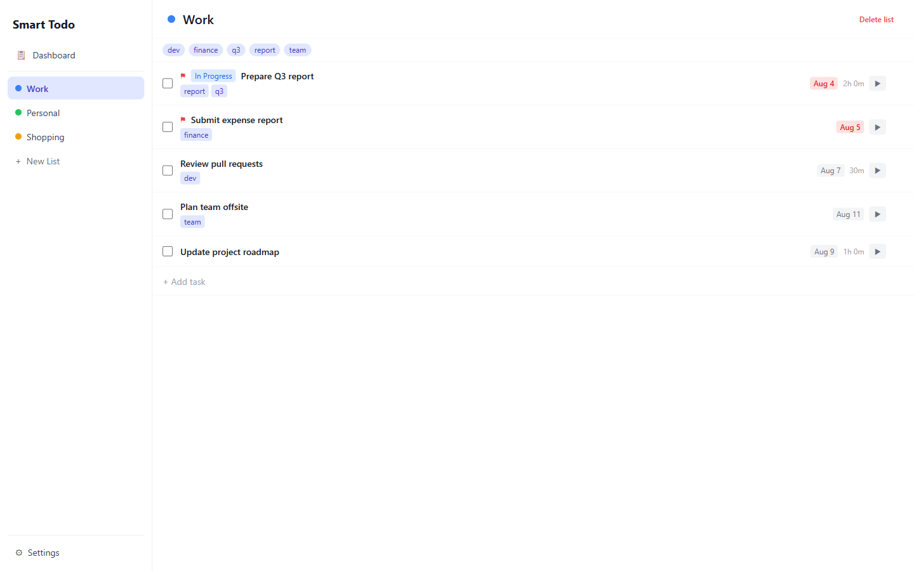
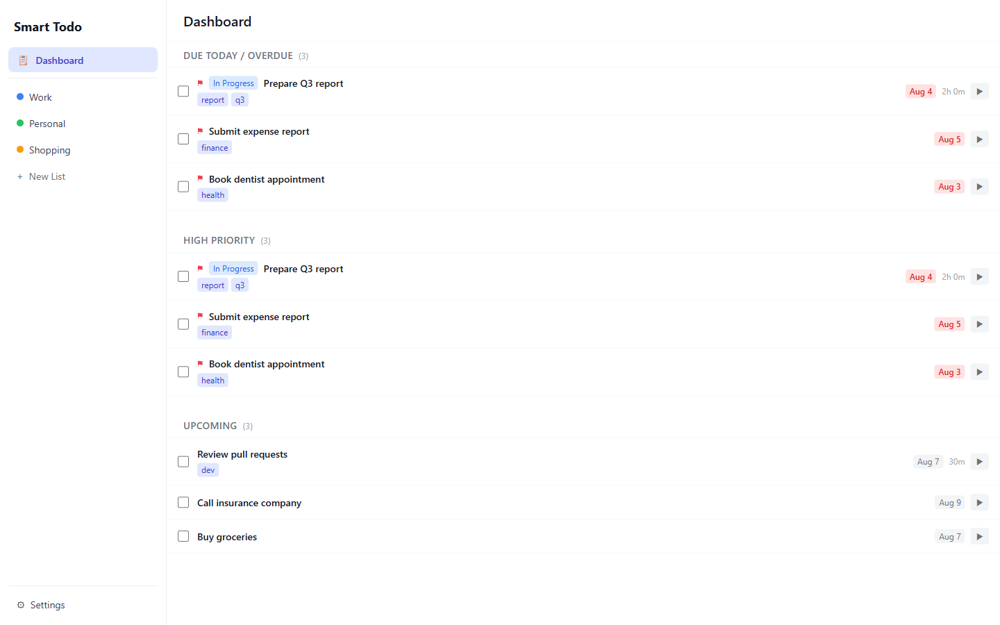
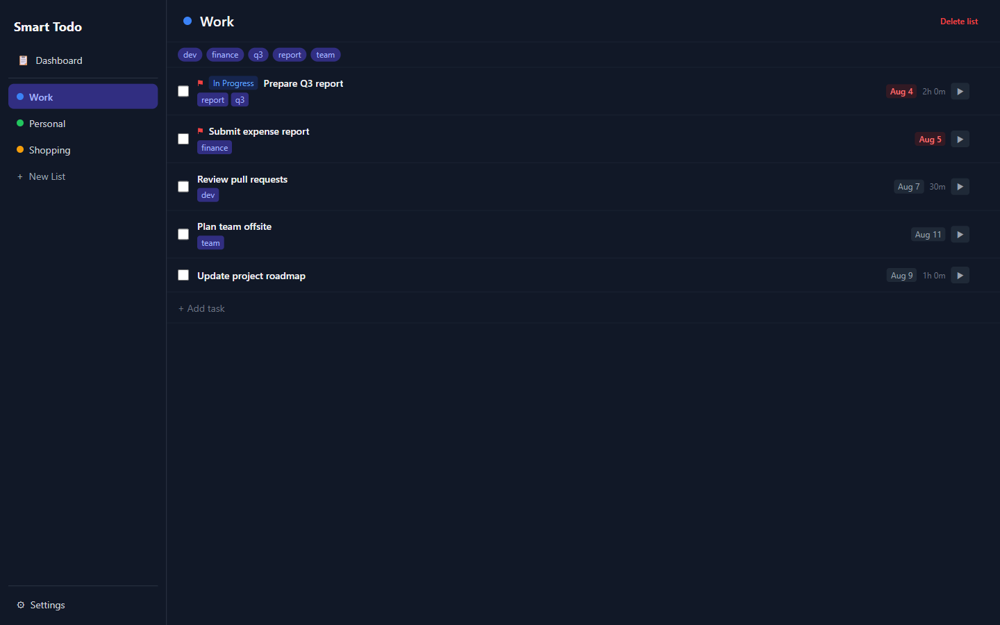
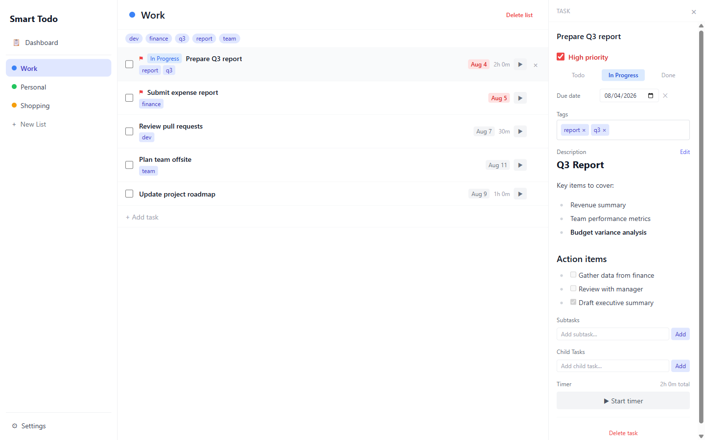
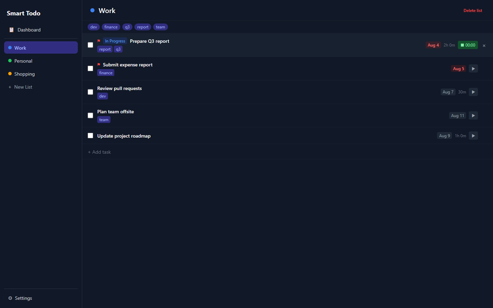
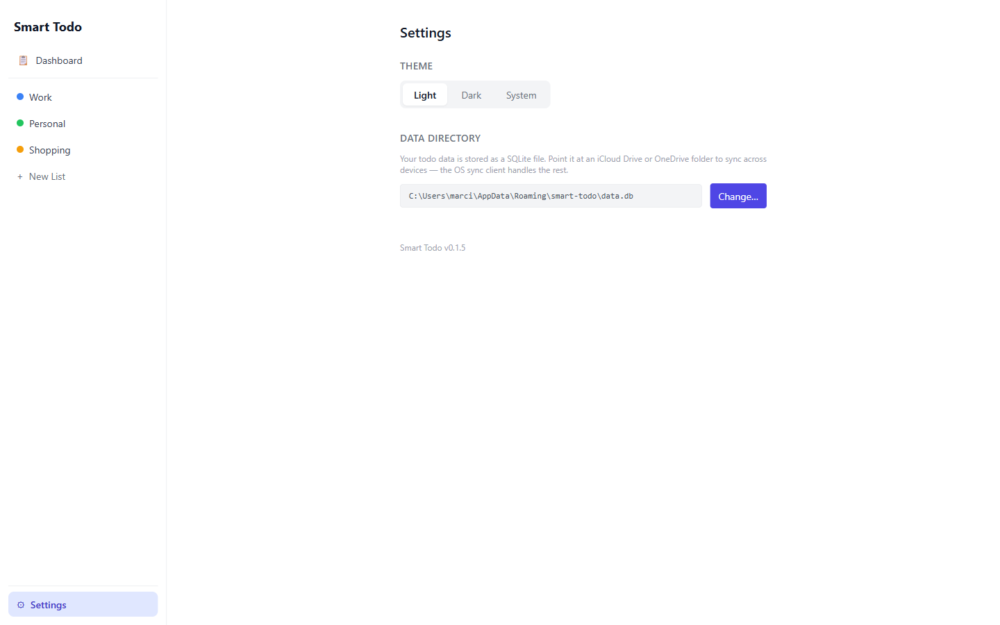
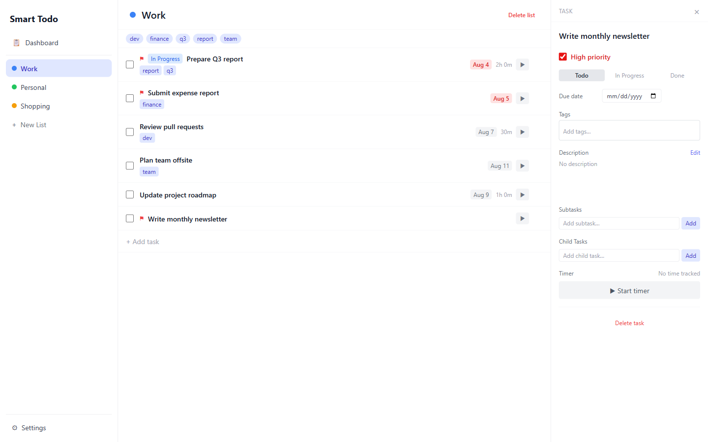
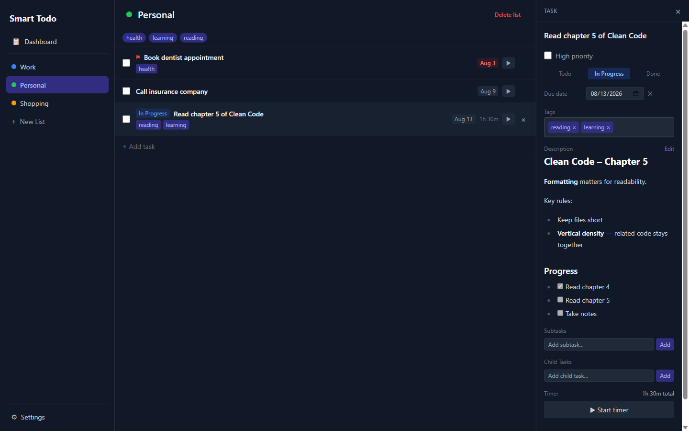
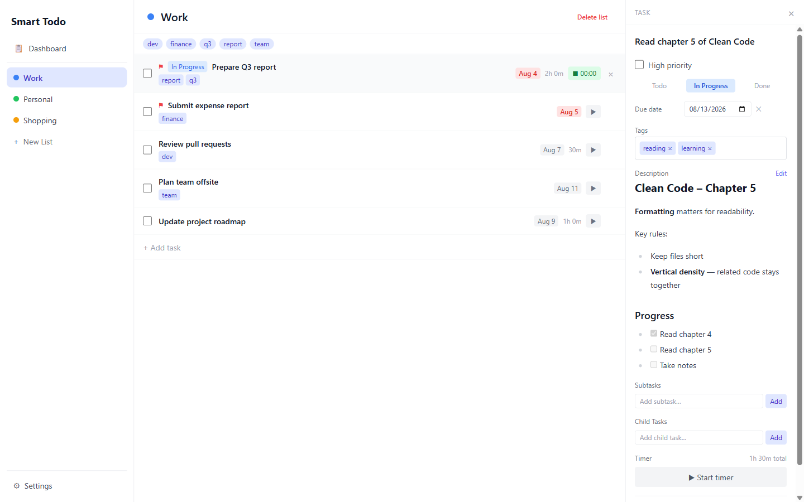
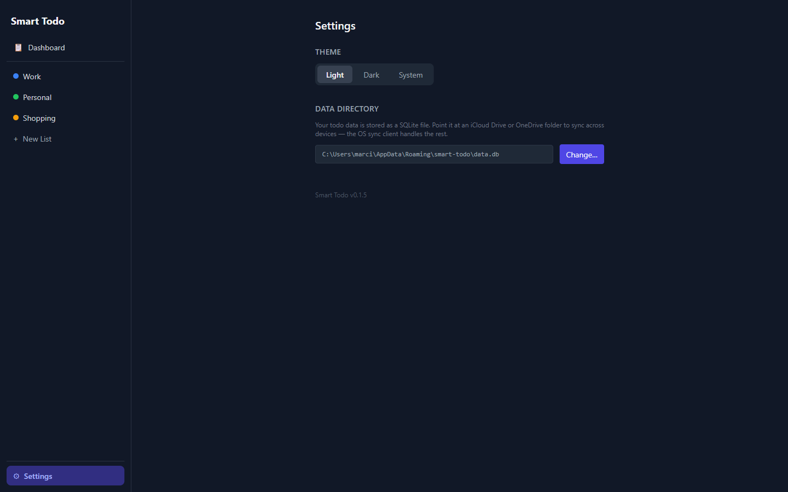

# Smart Todo

**A fast, cross-platform desktop todo app. Write tasks in Markdown, track time with built-in timers, and sync across devices via your cloud storage folder.**


[](https://github.com/letyshub/smart-todo/releases/latest)



---

## Features

Everything you need to manage your tasks, nothing you don't.

**Core task management**

- Create and organize tasks into multiple lists
- Task status: Todo, In Progress, and Done
- Priority flags and due dates on every task
- Subtasks (checkboxes) and child tasks (full task entries you can open and edit)
- Tags for cross-list organization

**Rich editing**

- Markdown descriptions with live preview — write in Markdown, read in clean formatted text
- Links in descriptions open in your default browser
- Built-in timer per task with full session history

**App-level features**

- Dashboard — see Overdue, High Priority, and Upcoming tasks at a glance
- Light, Dark, and System theme
- Configurable data directory — point at iCloud Drive or OneDrive for automatic sync across devices
- Available on Windows, Linux, and macOS

---

## Screenshots

<table>
  <tr>
    <td align="center" width="50%">
      <br/>
      <em>Dashboard — see what needs attention at a glance</em>
    </td>
    <td align="center" width="50%">
      <br/>
      <em>Task list — track status, priority, and due dates</em>
    </td>
  </tr>
  <tr>
    <td align="center" width="50%">
      <br/>
      <em>Task editor — Markdown descriptions, tags, subtasks, and more</em>
    </td>
    <td align="center" width="50%">
      <br/>
      <em>Built-in timer — track time spent on any task</em>
    </td>
  </tr>
  <tr>
    <td align="center" width="50%">
      <br/>
      <em>Settings — theme, data directory for cloud sync, and version info</em>
    </td>
    <td></td>
  </tr>
</table>

---

## Installation

No setup required — just download and run.

### Windows

1. Download `Smart.Todo_x.x.x_x64_en-US.msi` from [Releases](https://github.com/letyshub/smart-todo/releases/latest)
2. Run the installer and follow the prompts
3. Launch Smart Todo from the Start Menu

### macOS

1. Download `Smart.Todo_x.x.x_x64.dmg` from [Releases](https://github.com/letyshub/smart-todo/releases/latest)
2. Open the DMG, drag Smart Todo to Applications
3. Launch from Applications — on first launch, right-click and choose **Open** if macOS Gatekeeper blocks it

### Linux

1. Download `smart-todo_x.x.x_amd64.AppImage` from [Releases](https://github.com/letyshub/smart-todo/releases/latest)
2. Make it executable:
   ```bash
   chmod +x smart-todo_*.AppImage
   ```
3. Run it:
   ```bash
   ./smart-todo_*.AppImage
   ```

> **Where is your data?** Smart Todo stores everything in a single SQLite file in your system app data folder. You can change this in **Settings → Data Directory** — see [Syncing across devices](#syncing-across-devices-with-cloud-storage) below.

---

## Usage

### Creating your first list and task

1. Click **+ New List** in the sidebar and type a name for your list
2. Inside the list, click **+ Add task** and type your task title, then press Enter
3. Click the task to open the editor — set a due date, priority, description, and tags



*Create a task with a name, due date, and priority in seconds*

---

### Using the task editor (Markdown, tags, subtasks)

1. Click any task to open the editor panel on the right
2. Write a description using Markdown — it renders in preview mode automatically (click **Edit** to go back to writing)
3. Add tags by typing in the tag field and pressing Enter
4. Add subtasks using the subtask checklist below the description — check them off as you go



*Rich task editor with Markdown preview, tags, and subtasks*

---

### Tracking time on a task

1. Click **▶** on any task card — the timer starts immediately
2. The timer keeps running even if you close the task editor or switch to another list
3. Click **⏹** (the same button) to stop the timer and save the session



*Start the timer from any task — it keeps running in the background*

---

### Syncing across devices with cloud storage

Smart Todo uses a plain SQLite file — no account needed. To sync across devices, point the data file at a folder your cloud storage client already manages:

1. Open **Settings** (gear icon in the sidebar)
2. Click **Change…** next to the data directory path
3. Navigate to a folder inside your iCloud Drive, OneDrive, or Dropbox
4. Smart Todo copies your database there and uses it from that point on
5. On your second device, install Smart Todo and set the **same cloud folder** as the data directory



*Point the data directory at a cloud folder to sync across devices*

> **Tip**: Give the cloud client a few seconds to finish syncing before opening Smart Todo on the second device to avoid any conflicts.

---

## Building from Source

Want to build Smart Todo yourself or contribute? Here's everything you need.

### Prerequisites

- [Node.js](https://nodejs.org/) 18 or later (includes npm)
- [Rust](https://rustup.rs/) stable toolchain via rustup
- [Tauri CLI prerequisites](https://tauri.app/start/prerequisites/) for your OS — on Windows, WebView2 is installed automatically by the Tauri installer

### Clone and run

```bash
git clone https://github.com/letyshub/smart-todo.git
cd smart-todo
npm install
npx tauri dev
```

> The first run downloads Rust crates and may take a few minutes. Subsequent runs are much faster.

### Production build

```bash
npx tauri build
```

Output is placed in `src-tauri/target/release/bundle/`. You will find the platform-specific installer there (`.msi` on Windows, `.dmg` on macOS, `.AppImage` and `.deb` on Linux).

### Running tests

```bash
# Frontend (Vitest)
npm test

# Rust backend
cd src-tauri
cargo test
```

---

## Tech Stack

Smart Todo is built on modern, proven technologies.

| Layer | Technology |
|---|---|
| Desktop framework | [Tauri 2](https://tauri.app/) |
| Frontend | [React 18](https://react.dev/), [TypeScript 5](https://www.typescriptlang.org/), [Vite 5](https://vitejs.dev/) |
| Styling | [Tailwind CSS 3](https://tailwindcss.com/) |
| State management | [Zustand 4](https://zustand-demo.pmnd.rs/) |
| Backend | [Rust](https://www.rust-lang.org/) (stable) |
| Database | [SQLite](https://www.sqlite.org/) via [rusqlite](https://github.com/rusqlite/rusqlite) (bundled) |
| Date handling | [chrono](https://github.com/chronotope/chrono) |
| Markdown | [react-markdown](https://github.com/remarkjs/react-markdown) + [remark-gfm](https://github.com/remarkjs/remark-gfm) |
| Testing (frontend) | [Vitest](https://vitest.dev/), [@testing-library/react](https://testing-library.com/) |
| Testing (backend) | cargo test with in-memory SQLite |

---

## Contributing

Contributions are welcome. If you have an idea or found a bug, please [open an issue](https://github.com/letyshub/smart-todo/issues) first to discuss it before sending a pull request.

To contribute code:

1. Fork the repository
2. Create a branch: `git checkout -b my-change`
3. Make your changes and ensure tests pass: `npm test` and `cargo test`
4. Open a pull request against `main`

---

## License

This project is licensed under the [MIT License](LICENSE).
